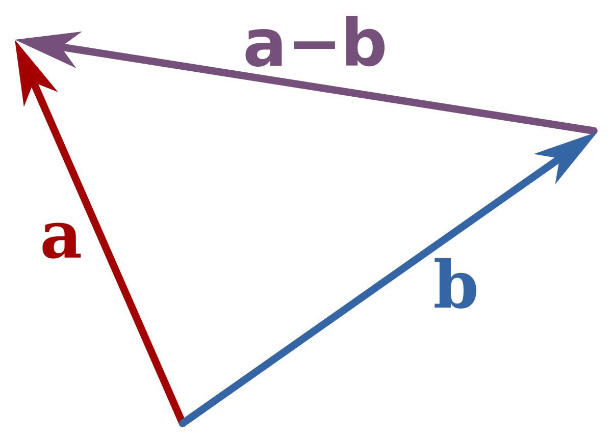

# K means clustering

K means clustering is a method of grouping data, depending on the chosen value of k, the data will be split into k clusters each with their own `centroid` which is at the center of each cluster, each group is defined as how close the data points are to their respective centroid.

## The algorithm

### Interlude into euclidian distance

The algorith uses the notion of `euclidian distance` e.g for some co-ordinate, $\bold{x}$ it's euclidian distance from the origin is denoted by $|\bold{x}| = \sqrt{\sum_i{x_i^2}}$, further we can find the distance between two vectors by looking into the difference of the vectors. 

  

We can find the distance between two vectors $\bold{x},\bold{y}$ by taking the magnitude of their difference: $|\bold{x} - \bold{y}| = \sqrt{\sum_i{(x_i-y_i)^2}}$.

### Back to business

1. Choose k random points in the plane to be the initial centroids of the groups
2. Calculate the distance between all points and these clusters and store the results
3. Based on distance calculation assign each point to it's closest cluster
4. Update the centroid locations to be the mean of their closest points.
5. If at step 4 the centroid locations change, repeat step 2 onwards, if not, terminate the algorithm.

### Da maths

Suppose that we have a centroid that we call $\bold{c}_i$ and we have $N$ datapoints stored in a list of vectors: $(\bold{x}_1,...,\bold{x}_{N})$, then to calculate the distances for each vector we run the following calculation to find the distance between centroid $i$ and datapoint $j$:

$$
d_{i,j} = |\bold{c_i} - \bold{x_j}|
$$

Our aim now is to minimise the square error of this quantity over all $i$ clusters and $j$ datapoints, that is to say:

$$
MSE = \sum_{i = 1}^{k}\sum_{j=1}^{N}d_{i,j}^2
$$

We minimise this sum by choosing points closest to clusters and then iterating on that.